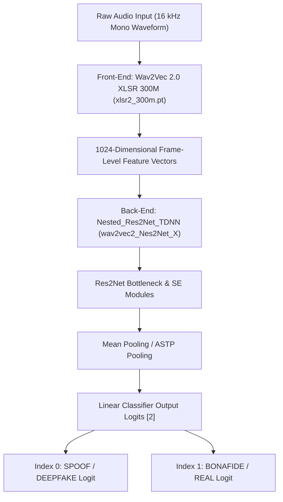

# 🚀 Nes2Net Model Complete Workflow & Architecture Guide

Welcome to the comprehensive workflow documentation for **Nes2Net** (*A Lightweight Nested Architecture for Foundation Model Driven Speech Anti-spoofing*, accepted at **IEEE Transactions on Information Forensics and Security (T-IFS 2025)**).

---

## 📐 1. Architecture & How Nes2Net Works

Nes2Net is designed to detect synthetic speech and audio deepfakes with extremely high accuracy while maintaining a lightweight parameter count (~511k back-end parameters).



### Key Components
1. **Front-End Feature Extractor**:
   - Uses Meta's **Wav2Vec 2.0 XLSR (300M parameters)** loaded via `fairseq`.
   - Extracts 1024-dimensional temporal frame representations directly from raw speech waveforms.
2. **Back-End Classifier**:
   - **`Nested_Res2Net_TDNN`** (`model_scripts/wav2vec2_Nes2Net_X.py`): Multi-scale nested block structure combining multi-scale Res2Net convolutions with Squeeze-and-Excitation (SE) bottleneck modules.
3. **Output Logit & Label Convention**:
   - **Index 0 (`logits[0]`)** = **SPOOF / DEEPFAKE**
   - **Index 1 (`logits[1]`)** = **BONAFIDE / REAL**

---

## 📦 2. System & Package Requirements

### Recommended Environment
- **OS**: macOS / Linux / Windows
- **Python Version**: `Python 3.10` (Required for full compatibility with `fairseq` and PyTorch without dataclass errors).

### Required Libraries
| Package | Purpose |
| :--- | :--- |
| `torch` (>= 2.0) | Deep Learning Framework & Tensor Computation |
| `torchaudio` | Audio Tensor Utilities |
| `fairseq` (0.12.2) | Loading Pre-trained Wav2Vec 2.0 XLSR Checkpoint |
| `librosa` | Audio Loading, Resampling (16 kHz mono), & Preprocessing |
| `soundfile` | Lossless Audio I/O (`.wav`, `.flac`) |
| `numpy` / `scipy` | Mathematical Computations & Signal Processing |
| `hydra-core` / `omegaconf` | Model Configuration Management |
| `gdown` / `aria2` | High-speed Model Weights Downloading |

### Installation Commands
```bash
# 1. Create a Python 3.10 Virtual Environment
python3.10 -m venv .venv
source .venv/bin/activate

# 2. Upgrade Pip & Install PyTorch + Audio Libraries
pip install --upgrade pip
pip install torch torchaudio librosa soundfile numpy scipy omegaconf hydra-core bitarray tensorboardX gdown tqdm

# 3. Install Fairseq from source without dependency resolution conflicts
pip install --no-deps git+https://github.com/facebookresearch/fairseq.git
```

---

## 💾 3. Required Pre-trained Checkpoints

To execute inference, two pre-trained model checkpoint files must be placed in the root directory:

| Checkpoint File | Size | Description | Download Command |
| :--- | :--- | :--- | :--- |
| **`xlsr2_300m.pt`** | ~3.8 GB | Meta Fairseq Wav2Vec 2.0 XLSR 300M Foundation Model | `aria2c -x 16 -s 16 https://dl.fbaipublicfiles.com/fairseq/wav2vec/xlsr2_300m.pt` |
| **`wav2vec2_Nes2Net_X_best.pth`** | ~1.2 GB | Pre-trained Nes2Net-X Back-end Checkpoint (ASVspoof 2021 DF) | `python -c "import gdown; gdown.download(id='1JFGv_2TONMnTLGbiOIuHFfMvuo4SIIpg', output='wav2vec2_Nes2Net_X_best.pth', resume=True)"` |

---

## 📂 4. Repository File Flow & Architecture

```text
Nes2Net_ASVspoof_ITW/
├── model_scripts/
│   ├── wav2vec2_Nes2Net_X.py       # Core Nes2Net architecture (SSLModel + Nested_Res2Net_TDNN)
│   └── wav2vec2_AASIST.py         # Baseline AASIST architecture
├── data_utils_SSL.py               # Audio data loaders, padding (64,600 samples), label mapping
├── RawBoost.py                     # RawBoost data augmentation (LnL convolutive noise, ISD/SSI additive noise)
├── startup_config.py               # Seed initialization & CuDNN deterministic settings
├── main.py                         # Model training & full evaluation pipeline script
├── run_audio_inference.py          # Custom runner for single audio file testing (.wav, .mp3, .m4a)
├── batch_inference.py              # Batch runner for evaluating audio directories
├── evaluate_2021_LA.py / DF.py     # Protocol scoring for ASVspoof 2021 LA & DF tracks
├── Cal_EER_in_the_wild.py          # EER computation script for In-The-Wild dataset
├── all_audio_test_results.md       # Generated benchmark test output report
├── xlsr2_300m.pt                   # Pre-trained XLSR 300M weights
└── wav2vec2_Nes2Net_X_best.pth     # Pre-trained Nes2Net-X checkpoint
```

---

## ⚡ 5. How to Use & Execution Commands

### A. Test a Single Audio File (`run_audio_inference.py`)
Run inference on any individual audio file (`.wav`, `.mp3`, `.m4a`, `.flac`):

```bash
source .venv/bin/activate
python run_audio_inference.py --file_to_test "/path/to/your/audio_file.wav"
```

**Output Example**:
```text
--------------------------------------------------
📊 INFERENCE RESULTS
--------------------------------------------------
Raw Logits  -> Real (Bonafide): +4.7959  |  Spoof (Fake): -3.4356
Probability -> Real Voice:      99.97%
Probability -> Spoof/Deepfake:  0.03%
--------------------------------------------------
✅ CLASSIFICATION: REAL / BONAFIDE AUDIO (Confidence: 99.97%)
--------------------------------------------------
```

### B. Batch Test an Audio Folder (`batch_inference.py`)
Evaluate an entire directory of audio files and generate a structured markdown report (`all_audio_test_results.md`):

```bash
source .venv/bin/activate
python batch_inference.py
```

### C. Train Nes2Net Model on ASVspoof 2019 Dataset (`main.py`)
To train Nes2Net-X from scratch:

```bash
python main.py \
  --track=LA \
  --lr=0.00000025 \
  --batch_size=12 \
  --algo 4 \
  --date 0520 \
  --seed 12345 \
  --loss=WCE \
  --model_name wav2vec2_Nes2Net_X \
  --num_epochs 100 \
  --pool_func 'mean' \
  --SE_ratio 1 \
  --Nes_ratio 8 8 \
  --database_path /path/to/ASVspoof2019/LA/
```

### D. Evaluate Checkpoints on ASVspoof 2021 Dataset
To evaluate a trained checkpoint on ASVspoof 2021 DF:

```bash
python main.py \
  --track=DF \
  --batch_size=2 \
  --is_eval \
  --eval \
  --model_name wav2vec2_Nes2Net_X \
  --pool_func 'mean' \
  --SE_ratio 1 \
  --Nes_ratio 8 8 \
  --test_protocol '4sec' \
  --database_path '/path/to/ASVspoof2021/DF/' \
  --model_path="wav2vec2_Nes2Net_X_best.pth" \
  --eval_output='score_DF_Nes2Net_X.txt'

# Compute EER score
python evaluate_2021_DF.py score_DF_Nes2Net_X.txt /path/to/keys eval
```
